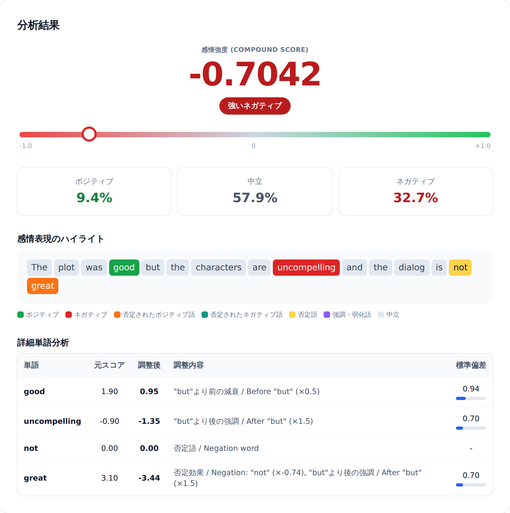

# VADER感情分析ツール

[](https://github.com/nozomi-sawada/vader-sentiment-analyzer/actions/workflows/test.yml)
[](https://opensource.org/licenses/MIT)
[](https://github.com/cjhutto/vaderSentiment)
[](https://developer.mozilla.org/en-US/docs/Web/HTML)
[](https://developer.mozilla.org/en-US/docs/Web/JavaScript)

[English](README.md) | **日本語**

---

## 概要

本ツールは、Hutto & Gilbert (2014) によるVADER (Valence Aware Dictionary and sEntiment Reasoner) アルゴリズムのブラウザベース実装です。分析エンジンは本家Python実装（vaderSentiment 3.3.2）の移植であり、出力が本家と一致することを自動テストで確認しています。辞書・ルールベースの感情分析を理解し、研究や教育で利用したい方に向けて開発しました。



## 主な特徴

- **ブラウザベース** - インストールもサーバーも不要
- **すぐに使える** - VADERレキシコンを同梱（MITライセンス）し、自動で読み込み
- **オフライン動作** - 外部依存なし
- **日本語 / 英語UI** - ワンクリックで表示言語を切り替え
- **ルールベース** - 辞書・ルールベースのスコアリングで、適用された調整をすべて表示
- **絵文字対応** - 絵文字を説明文に変換して分析（オプション）
- **単語ごとの詳細表示** - 各単語のスコア調整プロセスを表示
- **文単位分析** - VADER論文が推奨する文ごとの分析に対応
- **レキシコン探索** - 約7,500語の感情語彙を検索・閲覧
- **レキシコン統計** - 分布グラフ、上位ポジティブ/ネガティブ語、標準偏差

## クイックスタート

### ツールの実行

1. このリポジトリをダウンロード（「Code」→「Download ZIP」を展開）またはクローンし、`index.html` を開く
2. 同梱のVADERレキシコンと絵文字レキシコンが自動で読み込まれます
3. テキストを入力して「分析する」をクリック

> [!NOTE]
> 自動読み込みはHTTP経由でページを開いた場合（GitHub Pagesやローカルサーバーなど）に動作します。`index.html` をファイルとして直接開いた場合は、画面のボタンからレキシコンファイル（`third_party/vaderSentiment/` にあります）を手動で読み込んでください。

### 別のレキシコンを使う場合

画面のファイル選択から、同梱のレキシコンをいつでも差し替えられます（カスタマイズした `vader_lexicon.txt` など）。オリジナルのファイルは https://github.com/cjhutto/vaderSentiment で配布されています。

### 分析モードの選択

- **通常モード** - テキスト全体を1つとして分析
- **文分割モード** - 文ごとに分割して分析（VADER論文推奨）

## VADERアルゴリズムについて

### 理論的背景

VADERは、ソーシャルメディアテキストの感情分析に特化した辞書・ルールベースの感情分析ツールです。従来の感情分析手法の3つの主要な欠点に対処するために設計されました：

1. **カバレッジ** - 従来のレキシコンはソーシャルメディア特有の表現（スラング、顔文字、略語）を無視することが多い
2. **強度認識** - 多くの手法が感情の強度の違いを無視
3. **効率性** - 機械学習手法は大量の学習データが必要で計算コストが高い

### 主要な特性

- **ソーシャルメディア特化** - インフォーマルな表現、スラング、非標準的な表記に対応
- **ルールベースアプローチ** - 機械学習を使用せず完全に解釈可能
- **実証的妥当性** - 人間評価者との高い相関（元論文でPearson's r = 0.88）
- **性能** - Twitterデータで F1 スコア 0.96（元論文報告値）

### スコアの解釈

**Compound Scoreの範囲:** -1.0～+1.0（正規化済み）

Compound Scoreは以下の式で正規化されます：
```
compound = Σ(valence_i) / √(Σ(valence_i²) + α)
```
ここで α = 15（正規化パラメータ）

この正規化により：
- スコアが[-1.0, +1.0]の範囲に収まる
- 異なる長さのテキストでも公平に比較可能
- 極端な値が適切に抑制される

**分類閾値**（元論文に基づく）：

| Compound Score | 分類 | 説明 |
|----------------|------|------|
| score ≥ 0.05 | ポジティブ | 肯定的な感情を含むテキスト |
| -0.05 < score < 0.05 | 中立 | 感情的に中立的なテキスト |
| score ≤ -0.05 | ネガティブ | 否定的な感情を含むテキスト |

> [!NOTE]
> これらの閾値は一般的なソーシャルメディアテキストに対して最適化されています。ドメインや研究目的に応じて、閾値の調整が必要となる場合があります。

**重要な注意: VADER論文との違い**

VADER論文では正規化の式を以下のように記述しています：
```
compound = Σ(valence_i) / √(Σ(valence_i²) + α)
```

しかし、**公式Python実装**では以下の式を使用しています：
```
compound = sum / √(sum² + α)
```

本ツールは既存のVADERユーザーとの互換性のため、公式Python実装に準拠しています。

## アルゴリズムの詳細

### 計算手順

VADERは以下の手順で感情スコアを計算します：

1. **トークン化とレキシコンマッチング**
   - 入力テキストをトークンに分割
   - 各トークンをVADERレキシコンと照合し、基本感情スコアを取得

2. **文法的・語用論的ルールの適用**

   | ルール | 効果 | 例 |
   |--------|------|-----|
   | **否定** | 極性反転（×-0.74） | "not good" → +1.9 → -1.41 |
   | **強調語** | スコア増減（±0.293） | "very good" → +1.9 → +2.19 |
   | **大文字** | 強調（±0.733） | "GOOD" → +1.9 → +2.63 |
   | **感嘆符** | テキスト全体への強調（+0.292/個、最大4個）を合計スコアに適用 | "good!" → 合計 +1.9 → +2.19 |
   | **疑問符** | テキスト全体への強調（2〜3個: +0.18/個、4個以上: +0.96） | "really??" |
   | **"but"節** | 前×0.5、後×1.5 | "good but bad" → 両方調整 |
   | **イディオム・特殊表現** | 固定スコアを適用 | "bad ass" → +1.5、"the shit" → +3 |
   | **"least" / "no"** | 文脈依存の否定 | "least good"、"no good" |

3. **正規化とCompound Scoreの計算**

   ```
   compound = Σ(valence_i) / √(Σ(valence_i²) + α)
   ```

   ここで α = 15（正規化パラメータ）

   この正規化により：
   - スコアは概ね[-1.0, +1.0]の範囲に収まる
   - 単語数が異なるテキストも公平に比較可能
   - 極端な値を抑制

### 実装の忠実性

分析エンジン（`vader.js`）は、本家Python実装（[vaderSentiment 3.3.2](https://github.com/cjhutto/vaderSentiment)）を一行ずつ移植したものです。出力が本家と一致することは、自動化されたゴールデンテスト（後述の「テスト」参照）で検証されています：

- オリジナルのVADERレキシコンを使用したレキシコンベーススコアリング
- 本家と同一のトークン化（`SentiText`）：空白区切り＋句読点除去、`:)`、`:D`、`<3` などのエモーティコンを保持
- 否定処理（前方3トークン）："n't" 縮約形、"never so/this" 強調、"without doubt"、"least"、"no" の特殊ケースを含む
- 強調語（距離による減衰: 直前→×1.00, 2語前→×0.95, 3語前→×0.90）、大文字の強調語にも対応
- 大文字強調（ALL CAPS判定、±0.733）
- 句読点による強調（テキスト単位）：感嘆符（最大4個、+0.292/個）と疑問符（2〜3個: +0.18/個、4個以上: +0.96）
- "but"による文脈調整（前×0.5、後×1.5）
- イディオム（"bad ass"、"the shit"、"to die for"、"yeah right" など）と複数語の弱化表現（"kind of"、"sort of"）
- Compound正規化（α=15）と、本家と同一のpos/neu/neg比率計算（トークンごとの±1補正）
- 絵文字対応：本家と同一のインライン説明文変換（オプション）
- 文分割（略語保護：Mr., Dr. など）— VADER本体ではなく本ツール独自の追加機能

### ファイル構成

```
index.html          – マークアップのみ（インラインスクリプトなし）
vader.js            – VADERアルゴリズム本体（ブラウザ・Node.js両対応）
app.js              – UI層（ファイル読み込み、描画、言語切り替え、イベント処理）
tailwind.css        – ビルド済みスタイルシート（再生成: npm run build:css）
tailwind.input.css  – スタイルシートのソース
third_party/        – 同梱のVADERレキシコンファイル（MITライセンス、同ディレクトリ参照）
test/               – 本家Python実装とのゴールデンテスト
```

スタイルシートはビルド済みのものを同梱しているため、ビルドなしでそのまま動作します。
`index.html` や `app.js` のCSSクラスを変更した場合は `npm install && npm run build:css` で再生成してください。

### テスト

ゴールデンテストは、約100の例文（否定、強調語、大文字、句読点、イディオム、エモーティコン、絵文字、エッジケース）について本家Python実装の正確なスコアを記録し、`vader.js` がそれを再現することを検証します：

```bash
node test/run-tests.js        # vader.js を test/golden.json と照合
```

テストは `third_party/vaderSentiment/` の同梱レキシコンを使用します。

本家実装からゴールデンデータを再生成する場合：

```bash
pip install vaderSentiment==3.3.2
python3 test/generate_golden.py
```

## 使用例

### 基本的な分析
```
入力: "I love this product, it's amazing!"
結果: 強いポジティブ (0.8516)
  - love: +3.2
  - amazing: +2.8
  - 句読点による強調 (!): +0.292
```

### 否定の処理
```
入力: "This is not very good"
結果: 弱いネガティブ (-0.3865)
  - not: 否定語
  - very: 強調語
  - good: +1.9 → -1.62 (強調 +0.293 の後、否定効果 ×-0.74)
```

### "but"による文脈変化
```
入力: "The book offers fascinating ideas but sadly fails in its delivery."
結果: 強いネガティブ (-0.7311)
  - fascinating: +2.5 → +1.25 ("but"前 ×0.5)
  - sadly: -1.8 → -2.70 ("but"後 ×1.5)
  - fails: -1.8 → -2.70 ("but"後 ×1.5)
```

### 文単位分析
```
入力: "I love this! It's amazing! Quality is excellent!"
結果: 3文を個別に分析
  - 文1: 強いポジティブ (0.6696)
  - 文2: 強いポジティブ (0.6239)
  - 文3: 強いポジティブ (0.6114)
  平均: 0.6350
```

上記の例のスコアはすべて本家Python実装（vaderSentiment 3.3.2）の出力と同一です。

## 検証と信頼性

### 元論文での検証結果

Hutto & Gilbert (2014) は以下のデータセットでVADERの性能を検証：

| データセット | F1 Score | 精度 | 相関係数 |
|------------|----------|------|---------|
| Twitter | 0.96 | 96% | r = 0.881 |
| Movie Reviews | 0.94 | 94% | r = 0.850 |
| Product Reviews | 0.92 | 92% | r = 0.870 |

### 本実装の妥当性

分析エンジンは元のVADER実装（Python版）の移植です：

1. **主要なアルゴリズム** - 本家実装の直接移植：文法的・語用論的ルール、スコア計算式、正規化パラメータ、否定語の適用範囲
2. **レキシコンの使用** - オリジナルのVADERレキシコンを使用、標準偏差データも保持
3. **動作確認** - 約100の例文について、compound/pos/neu/negスコアが本家Python実装（vaderSentiment 3.3.2）と一致することを自動ゴールデンテストで検証（「テスト」の節を参照）

### 制限事項

研究者は以下の制限事項を認識した上で本ツールを使用する必要があります：

1. **言語制限** - 英語テキスト専用に設計
2. **ドメイン依存性** - ソーシャルメディアテキストに最適化、フォーマルな文章では精度が低下する可能性
3. **文脈理解の限界** - 皮肉や反語の検出能力には限界
4. **時間的変化** - レキシコンは2014年時点の評価に基づく、新しいスラングには対応していない可能性
5. **複数コードポイントの絵文字** - 肌の色付き（👍🏽）や家族などの結合絵文字（👨‍👩‍👧）は絵文字レキシコンにマッチしません。これは本家Python実装と同一の挙動です

## ブラウザ互換性

- Chrome / Edge 90+（推奨）
- Firefox 88+
- Safari 14+
- Internet Explorer は非対応

## セキュリティ機能

ブラウザ上で動作させるにあたり、次の対策を行っています：

### XSS（クロスサイトスクリプティング）対策

- 動的コンテンツはすべて`innerHTML`ではなく`textContent`と`createElement`で描画するため、ユーザー入力とレキシコンデータはエスケープされます

### 入力検証

- **ファイルサイズ制限** - ブラウザの応答性を保つため、ファイルあたり最大10MB
- **拡張子チェック** - `.txt`ファイルのみ受け付け
- **コンテンツ検証** - レキシコン形式を確認し、有効な行がないファイルは拒否

### コンテンツセキュリティポリシー（CSP）

ページには `script-src 'self'; style-src 'self'` のContent Security Policyを設定しており、同じフォルダ内のスクリプト・スタイルのみが実行可能です。外部リソース（CDN、フォント、アクセス解析など）は一切読み込みません。

## 学術利用ガイド

### 論文での記述例

#### 方法論セクション

**日本語:**

> 感情分析には、Hutto & Gilbert (2014) が開発したVADER (Valence Aware Dictionary and sEntiment Reasoner) を用いた。VADERは、約7,500語の感情語彙と文法的・語用論的ルールに基づく辞書ベースの手法であり、ソーシャルメディアテキストの感情分析に特化している。分析には、Sawada (2025) が開発したブラウザベースの実装ツールを使用した。Compound Scoreが+0.05以上をポジティブ、-0.05以下をネガティブ、その間を中立と分類した。

#### 結果セクション

**日本語:**

> VADER分析の結果、収集した1,000件のツイートのうち、62.3%がポジティブ（Compound Score ≥ 0.05）、18.7%がネガティブ（Compound Score ≤ -0.05）、19.0%が中立（-0.05 < Compound Score < 0.05）と分類された。平均Compound Scoreは+0.42（SD = 0.31）であった。

### 推奨される研究デザイン

1. **ソーシャルメディア分析** - Twitter、Facebook、Redditなどの短文テキスト
2. **時系列分析** - イベント前後の感情変化の追跡
3. **比較分析** - 複数グループ間やトピック別の感情比較
4. **妥当性検証** - データの一部を人間評価者で検証することを推奨

### 倫理的配慮

研究者は以下の倫理的配慮を行う必要があります：

1. **データの取得と使用** - 適切な同意手続き、プライバシー保護、プラットフォームの利用規約遵守
2. **結果の解釈** - アルゴリズムの限界を明示、過度な一般化を避ける、文脈の重要性を考慮
3. **透明性** - 使用したツールとバージョンの明記、分析パラメータの詳細な記載、再現可能性の確保

## 引用

### 必須（VADER元論文）

本ツールを使用する場合、以下の論文を引用してください：

```bibtex
@inproceedings{hutto2014vader,
  title={VADER: A parsimonious rule-based model for sentiment analysis of social media text},
  author={Hutto, C.J. and Gilbert, E.E.},
  booktitle={Eighth International Conference on Weblogs and Social Media (ICWSM-14)},
  year={2014},
  address={Ann Arbor, MI}
}
```

### 推奨（本ツール）

```bibtex
@software{sawada2025vader,
  author = {Sawada, Nozomi},
  title = {VADER-based Sentiment Analysis Tool},
  year = {2025},
  url = {https://github.com/nozomi-sawada/vader-sentiment-analyzer}
}
```

## ドキュメント

詳細なドキュメントは `docs/` フォルダにあります：

- **[ALGORITHM.ja.md](docs/ALGORITHM.ja.md)** - アルゴリズムの詳細実装
- **[LEXICON.ja.md](docs/LEXICON.ja.md)** - レキシコンの構造とアノテーション方法論
- **[CITATION.ja.md](docs/CITATION.ja.md)** - 学術利用のための詳細な引用ガイド

## ライセンス

本ツールはMITライセンスの下で公開されています。

> [!IMPORTANT]
> `third_party/vaderSentiment/` のVADERレキシコンファイルは、[元のリポジトリ](https://github.com/cjhutto/vaderSentiment)からMITライセンス（Copyright (c) 2016 C.J. Hutto）に基づき無改変で再配布しているものです。ライセンス文と出典は同ディレクトリに同梱しています。レキシコンを利用する場合は Hutto & Gilbert (2014) を引用してください。

## 謝辞

本ツールは以下の研究に基づいています：

> Hutto, C.J. & Gilbert, E.E. (2014). VADER: A Parsimonious Rule-based Model for Sentiment Analysis of Social Media Text. Eighth International Conference on Weblogs and Social Media (ICWSM-14). Ann Arbor, MI, June 2014.

VADERの開発者であるC.J. Hutto氏とEric Gilbert氏に感謝いたします。

---

**研究・教育目的で開発**

© 2025 Nozomi Sawada
